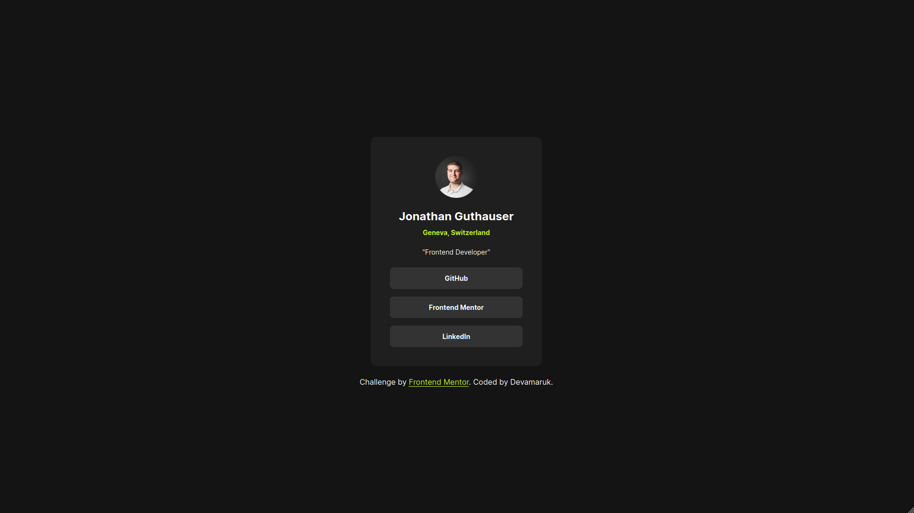
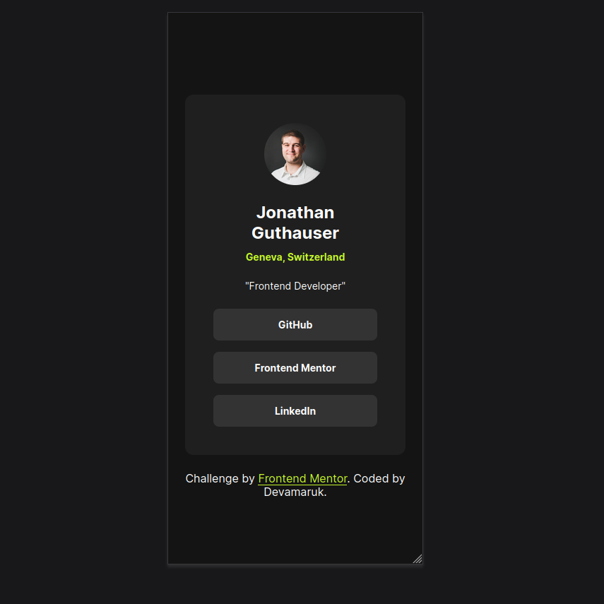

# Frontend Mentor - Social links profile solution

This is a solution to the [Social links profile challenge on Frontend Mentor](https://www.frontendmentor.io/challenges/social-links-profile-UG32l9m6dQ). Frontend Mentor challenges help you improve your coding skills by building realistic projects.

## Table of contents

- [Overview](#overview)
  - [The challenge](#the-challenge)
  - [Screenshot](#screenshot)
  - [Links](#links)
- [My process](#my-process)
  - [Built with](#built-with)
  - [What I learned](#what-i-learned)
  - [Useful resources](#useful-resources)
- [Author](#author)

## Overview

### The challenge

- The layout is responsive and change according to screen space.
- The users can see the buttons change color when hovering (only on Desktop)

### Screenshot

Desktop

Mobile

### Links

- Solution URL: [https://github.com/DevAmaruk/Social-links-profile](https://github.com/DevAmaruk/Social-links-profile)
- Live Site URL: [https://devamaruk.github.io/Social-links-profile/](https://devamaruk.github.io/Social-links-profile/)

## My process

### Built with

- Semantic HTML5 markup
- CSS custom properties
- Flexbox
- Mobile-first workflow

### What I learned

- I learned how to change the color of a link when hovered.
- I learned that buttons are essentially used for forms, so a "button" that sends a user to a new webpage is usually a link <a> tag disguised as a button.

### Useful resources

- [MDN - HTML Anchor Element](https://developer.mozilla.org/en-US/docs/Web/HTML/Reference/Elements/a) - This helped me to set the links correctly.

## Author

- Github - [Devamaruk](https://github.com/DevAmaruk)
- Frontend Mentor - [@DevAmaruk](https://www.frontendmentor.io/profile/DevAmaruk)
- Linkedin - [Jonathan Guthauser](https://www.linkedin.com/in/jguthauser/)
